## C++ 20 Generic Method : Raytracing in one week
* C++ 20 
* progress wip
* high performance rendering with threading blocks & std::async
* C++ faster random engine with CRTP + singleton

### CP_04_sphere_normal_hittable


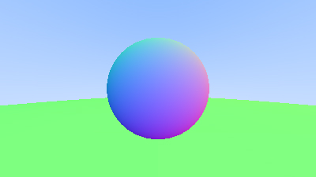


### CP_05_camera_pixelMultipleSamples

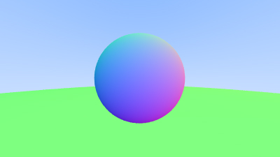


### CP_06_material_lambertian

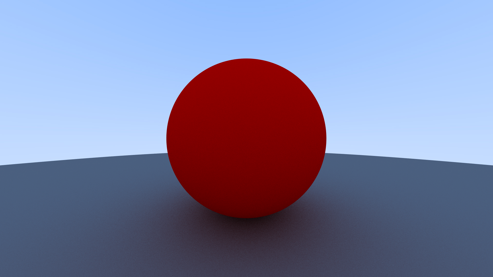


### CP_07_parallel_material_lambertian

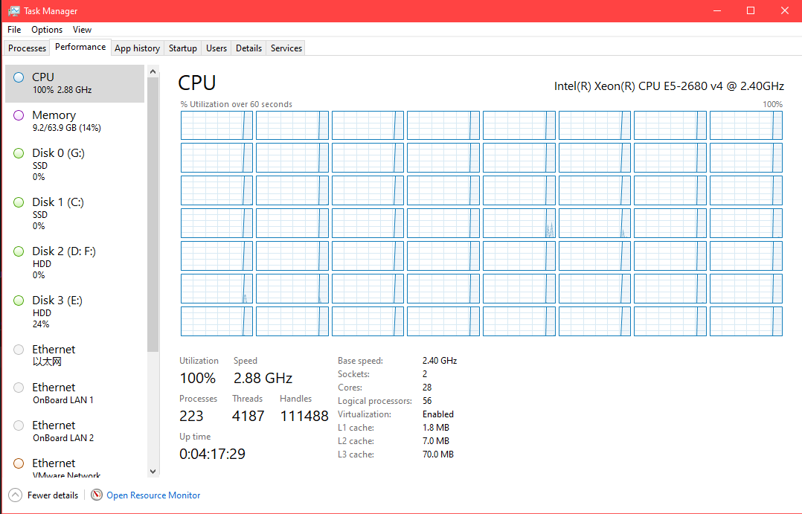

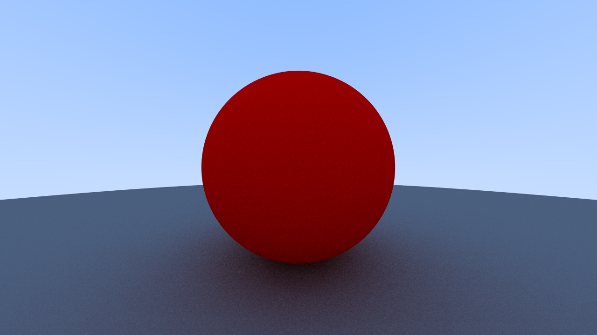


### CP_08_material_perfect_reflect_gamma_correct
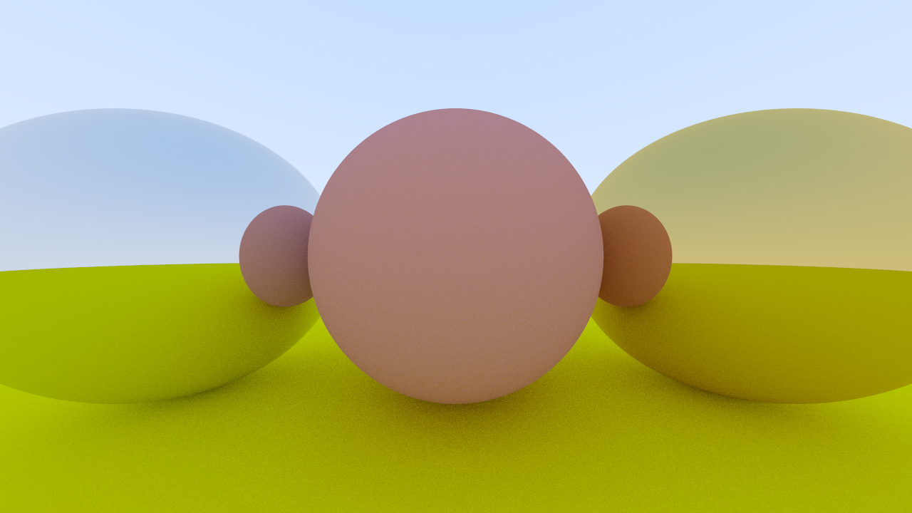


### CP_09_glossy_reflect
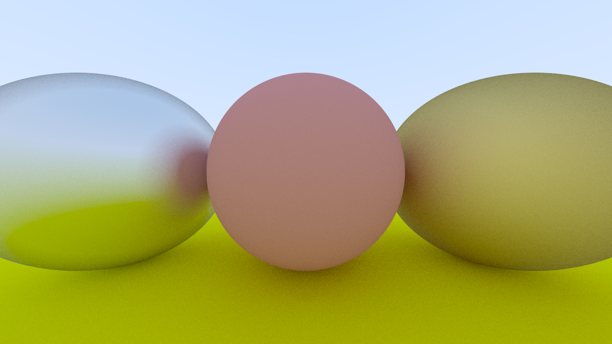
```
auto material_left   = std::make_shared<PerfectReflection>(Color(0.8, 0.8, 0.8), 0.5);
auto material_right  = std::make_shared<PerfectReflection>(Color(0.8, 0.6, 0.2),1);
```
render dt:100s, 100samplers, width=1280


* cos-weighted hemisphere is another choice, but need check the glossy reflected vector  is not entering the sphere
* (red is reflected vector)

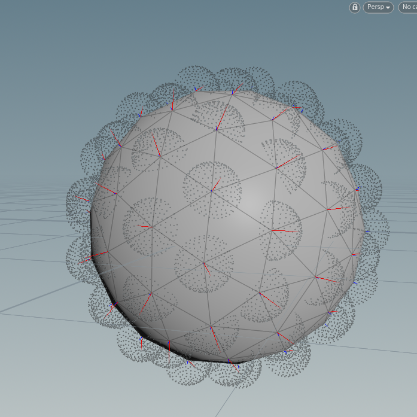

"raytracing in one weekend" is solves that problem. because it used this method:

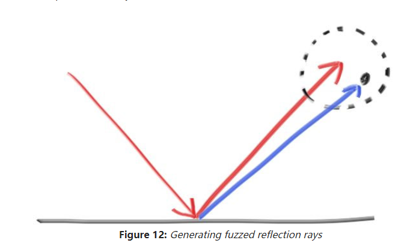

## CP_10_refract
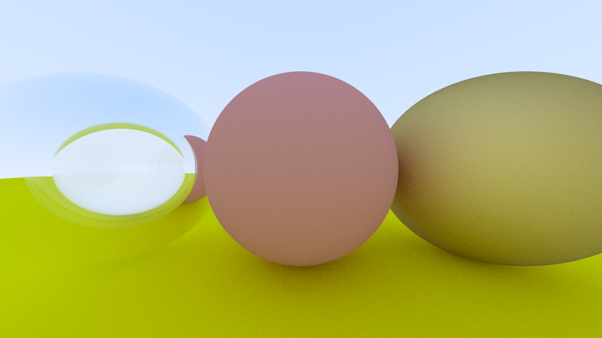

render time dt: 103s
* 折射向量推导
* 全内折射
* fresnel 多项式逼近

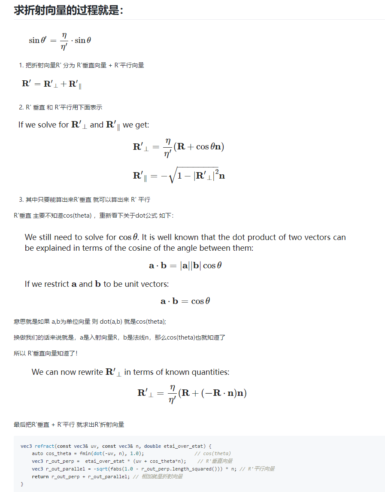


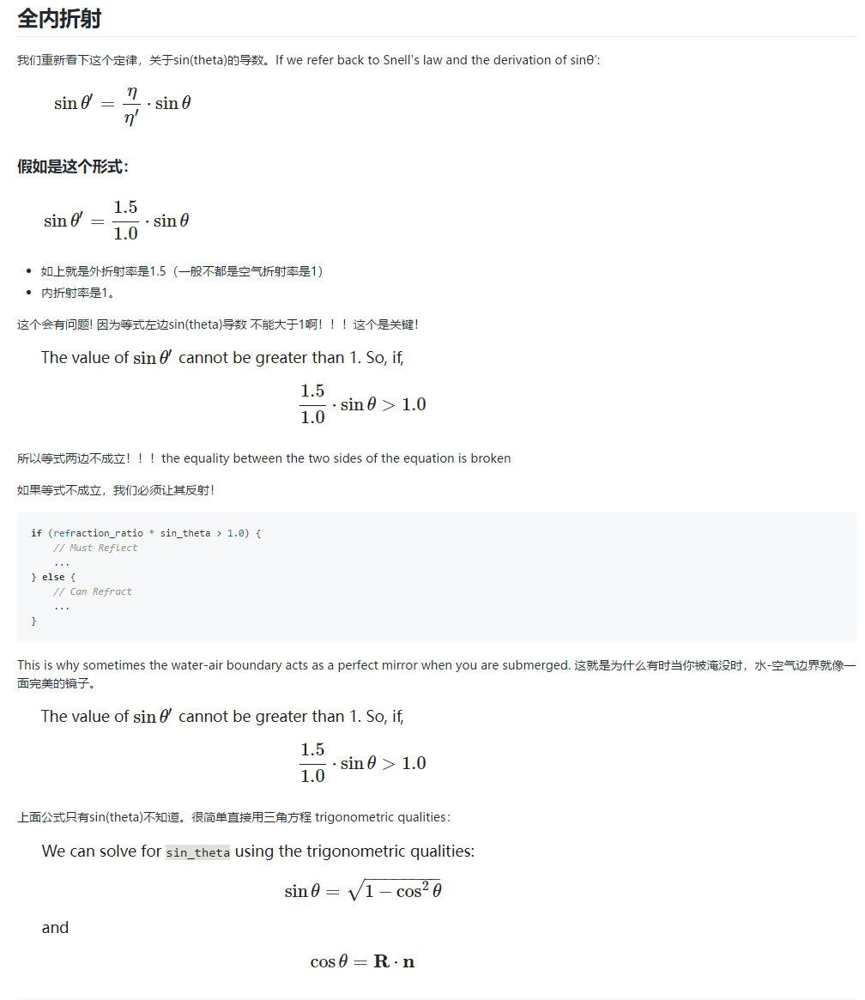

## CP_11 vertical field-of-view 

vfov:45

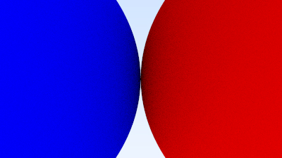

vfov:90

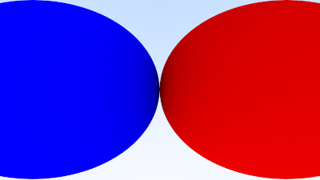