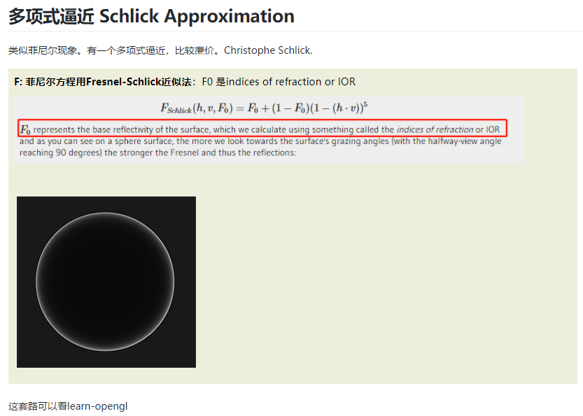

## C++ 20 Generic Method : Raytracing in one week
* C++ 20 
* progress wip
* high performance rendering with threading blocks & std::async
* C++ faster random engine with CRTP + singleton

### CP_04_sphere_normal_hittable


### CP_05_camera_pixelMultipleSamples


### CP_06_material_lambertian


### CP_07_parallel_material_lambertian


### CP_08_material_perfect_reflect_gamma_correct


### CP_09_glossy_reflect

```
auto material_left   = std::make_shared<PerfectReflection>(Color(0.8, 0.8, 0.8), 0.5);
auto material_right  = std::make_shared<PerfectReflection>(Color(0.8, 0.6, 0.2),1);
```
render dt:100s, 100samplers, width=1280


* cos-weighted hemisphere is another choice, but need check the glossy reflected vector  is not entering the sphere
* (red is reflected vector)


"raytracing in one weekend" is solves that problem. because it used this method:


## CP_10_refract


render time dt: 103s
* 折射向量推导
* 全内折射
* fresnel 多项式逼近
* **_上个图搞错了，原作者的折射率就是描述物体内部，我这个搞成外/内。所以折射率最后不是1.5 而是 1/1.5_** 
* main.cpp ior problem:
```c++
auto material_left   = std::make_shared<Dielectric>(1,1.5); // IOR = 1/1.5
// should change it to:
auto material_left   = std::make_shared<Dielectric>(1.5); // IOR = 1.5
```
* _**在材质里用默认一个参数的吧**_





## CP_11 vertical field-of-view 

vfov:45


vfov:90


## CP_12_lookfrom_lookat


* first image is fov:90
* second is fov:20

we can visualize all the scene in hou grandpa :

* white is look from point
* green is look to point
* middle is viewport


viewport vex code: unit_disk_xy_sample.hip:
```c++
float aspectWHRatio = 16.0 / 9; 
float theta = radians(90);
float h = tan(theta/2);
float viewPortHeight = 2.0 * h;
float viewPortWidth = aspectWHRatio * viewPortHeight;

printf("height:%d\n",viewPortHeight);
printf("width:%d\n",viewPortWidth);

vector look_from = chv("look_from");
vector look_at   = chv("look_to");
float lens_radius = chf("lens_radius");

vector vup = set(0,1,0);
vector w = normalize(look_from - look_at);
vector u = normalize(cross(vup, w));
vector v = cross(w, u);

vector horizontal =  u * viewPortWidth ;
vector vertical =  v * viewPortHeight;

vector lower_left_cornel = look_from - horizontal/2 - vertical/2 - w;
addpoint(geoself(), lower_left_cornel);//0


vector leftUpPos = lower_left_cornel + horizontal *0 + vertical*1 ; 
addpoint(geoself(), leftUpPos);//1


vector rightPos = lower_left_cornel + horizontal *1 + vertical*0 ;
addpoint(geoself(), rightPos);//2

vector rightPos2 = lower_left_cornel + horizontal *1 + vertical*1  ;
addpoint(geoself(), rightPos2);//3
```

all scene:


## CP_13_defocus

* follow the author: 
* render dt:137s:


#### houdini visualize scene:

* green is focus_plane
* white scatter points is lens_radius(actually is lens_radius / 2, in camera constructor: ```lensRadius = aperture / 2;```)


